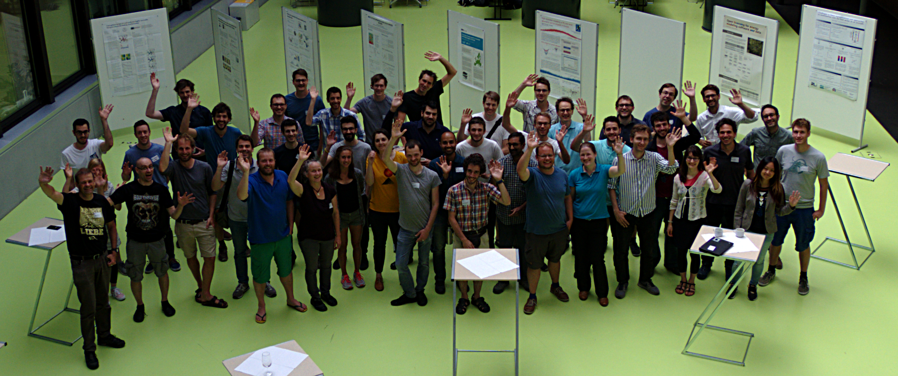

At last weeks meeting of the open energy modelling community ([openmod](http://www.openmod-initiative.org/)) in Zurich, Berit Müller from the REEEM consortium gave a lightening talk about the development of the REEEMgame and the Pathways Dialogue tool  developed in the project. We got good feedback and interesting comments. Many other interesting open-source tools have been presented there, like e.g. pyam - an open-source Python package for IAM scenario analysis and visualization.

For more information about the Workshop have a look at the openmod [wiki](https://wiki.openmod-initiative.org/wiki/Open_Energy_Modelling_Workshop_-_Zurich_2018).
