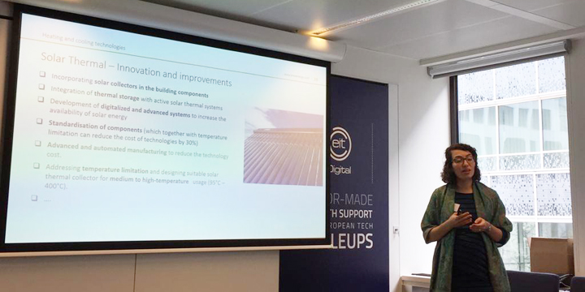
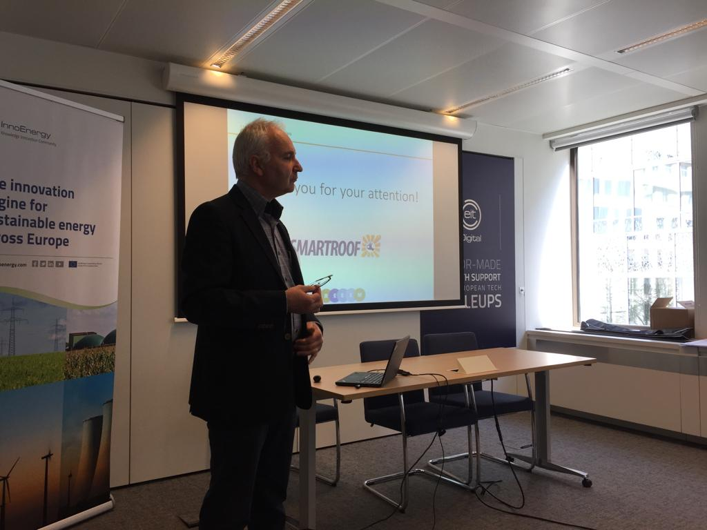
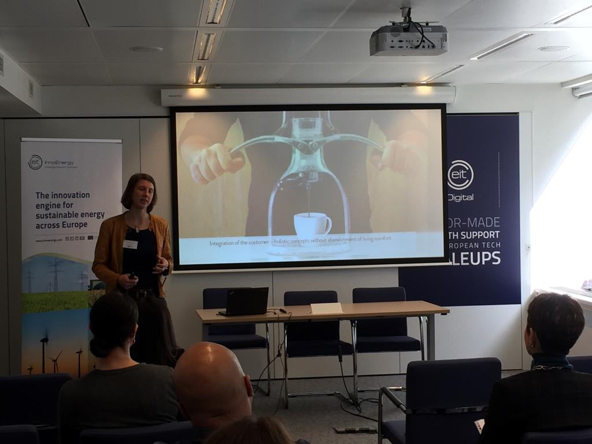
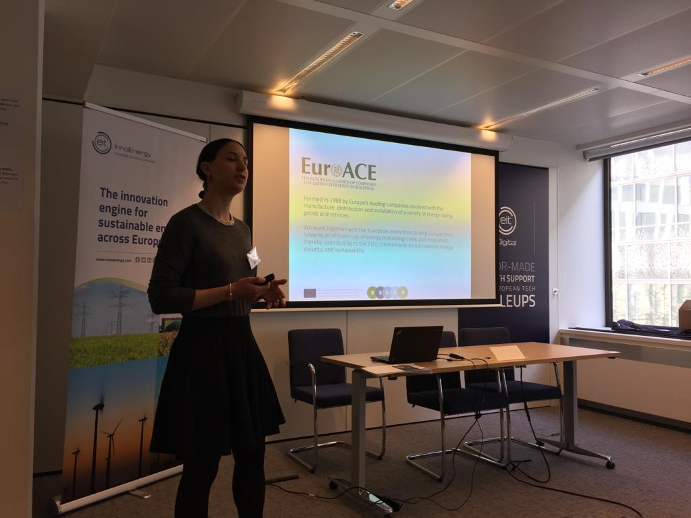

On March 19th, the last REEEM stakeholder workshop on Technology and Innovation Roadmap Workshop on Energy Efficiency in Buildings was hosted at EIT InnoEnergy in Brussels.

The full workshop agenda can be found [here.](../uploads/2019/03/Agenda-final.pdf)

The experts were giving presentations on different subjects in Energy Efficency in Buildings. You can find and download the speaker's presentations below.

#### DOWNLOADS

Theresa Steininger | Wohnwagon

[Off-Grid Solutions for Sustainable Living](https://next.rl-institut.de/s/NcpwpHN7sMqPF4W#pdfviewer)

Herreweghe Lode | Smartroof

[Smartroof Suntiles](https://next.rl-institut.de/s/GbizzxW4kpyoJnq#pdfviewer)

Hélène Sibileau | EuroACE

[Regulatory and Policy Aspects of Energy Efficiency in Buildings](https://next.rl-institut.de/s/zCT4WXMBac3smcd#pdfviewer)

Anna Darmani | InnoEnergy

[Energy Efficiency in Buildings](https://next.rl-institut.de/s/bHpsNyDqiFJ4ZSR#pdfviewer)

#### PHOTO GALLERY  

- 
    
    Lode Herreweghe, Smartroof
    
- 
    
    Theresa Steininger, Wohnwagon
    
- 
    
    Hélène Sibileau, EuroACE
