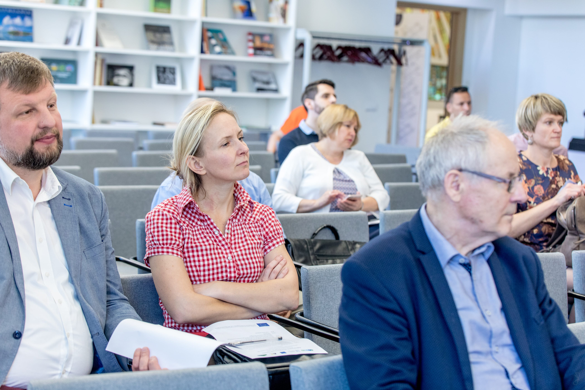

\[caption id="attachment\_2500" align="alignnone" width="4200"\] © Vygaudas Juozaitis LNB\[/caption\]

On June 4, one of the last REEEM Project stakeholder workshops was held in Vilnius. It aimed at discussing energy security and other energy transition issues that are especially relevant for the Baltic region.

Lina Sabaitienė, Vice-Minister of Energy of Lithuania, and Virgilijus Poderys, member of Lithuanian Parliament and Chair of the Commission for Energy and Sustainable Development, opened the workshop and highlighted the most important current issues in the energy landscape of the Baltic region.

The members of REEEM team provided insights on the results of the Project. Georgios Avgerinopoulos (KTH) presented an integrated impact assessment framework of decarbonisation pathways and other outputs of the overall project. This presentation was followed by more specific studies on district heating in Helsinki, Kaunas, and Warsaw; energy security in Baltic countries and Finland; distributional and energy poverty impacts of the energy transition.

The workshop was finalized with the discussion that covered both modelling and policy questions.

Workshop‘s presentations are provided below.

\[gallery link="file" columns="2" ids="2503,2505,2504,2506,2502,2512,2513,2516,2501"\]

 

 

 

 

**Presentation Downloads**

 

Georgios Avgerinopoulos

[Integrated impact assessment of decarbonisation pathways for the](http://www.reeem.org/wp-content/uploads/2019/06/Avgerinopoulos-min.pdf) [European Union - Insights from the REEEM Project](_wp_link_placeholder)

Linas Martišauskas

[Assessment of energy security coefficient for Baltic countries and Finland considering energy system resilience to disruptions](http://www.reeem.org/wp-content/uploads/2019/06/Martisauskas-min.pdf)

Arvydas Galinis

[Energy Security in Baltic Countries and Finland: development of electricity systems in Baltic States and Finland taking into account security and reliability aspects](http://www.reeem.org/wp-content/uploads/2019/06/Galinis-min.pdf)

Vidas Lekavičius

[Distributional and energy poverty impacts of energy transition](http://www.reeem.org/wp-content/uploads/2019/06/Lekavicius_REEEM-min.pdf)

Sanna Syri

[The role of district heating in decarbonization: insights from the case study on Helsinki region, Kaunas and Warsaw](http://www.reeem.org/wp-content/uploads/2019/06/Syri_DH_syri_Vilna_04062019-2-min.pdf)

Discussion

[Regional Aspects of European Energy Transition](http://www.reeem.org/wp-content/uploads/2019/06/Discussion_REEEM-min.pdf)
