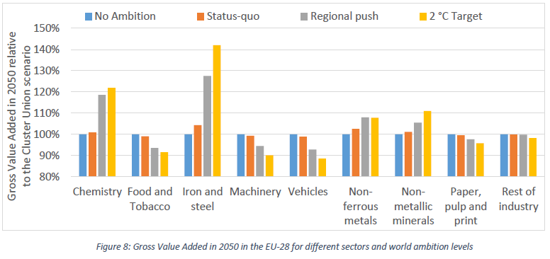

The figure shows how the different industry sectors react to different emission cuts outside of the EU, keeping the European cuts constant. The World scenarios range from No Ambition, meaning no specific policies to mitigate CO2 emissions, to 2°C target, where the emissions’ reductions are the highest and consistent with the 2°C target.

The Case Study on Carbon Leakage and Competitiveness in the EU analyzed over 20 scenarios varying both European and non-European emissions’ reduction targets to assess the impact of environmental over the competitiveness of EU´s energy intensive sectors. In addition, one workshop was organized in April 2018 in Brussels with stakeholders to present main results and receive feedback regarding extra scenarios. The results this deliverable suggest that the competitiveness of the energy intensive industries in the EU are affected by the CO2 reduction targets inside and outside of the EU.

High emission reduction targets in the EU cause higher loss in competitiveness in these sectors, however, higher emission cuts outside of the EU, increase their competitiveness and demonstrated that having the non-EU countries pursuing higher emission cuts is more effective to increase competitiveness of energy intensive sectors than freely allocating certificates. As for the other industry sectors, such as machinery and vehicles, they are more resilient to energy and environmental policies and are less affected by the EU emission targets.

You can find the full study [here](../uploads/2018/12/3.2-Case-Study-on-Carbon-Leakage-and-Competitiveness.pdf).
