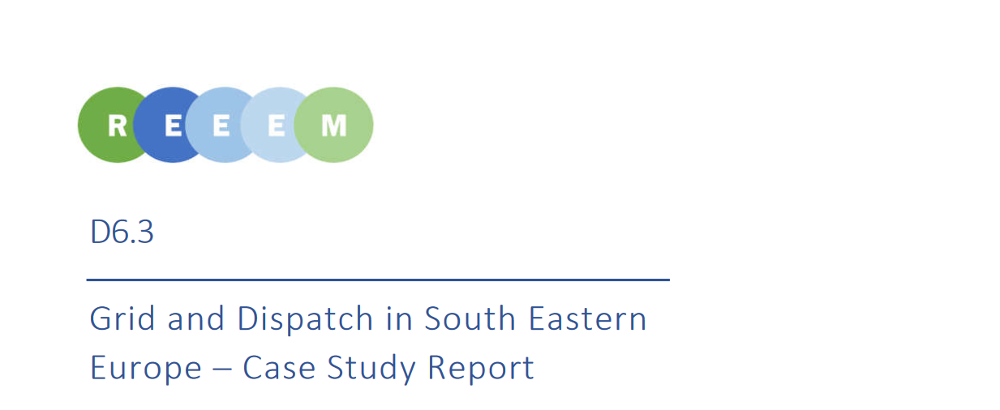

This deliverable includes methodology, main results and findings from case study on Grid and Dispatch in South Eastern Europe (SEE). Case studies in REEEM are considered to have a deeper look at certain regions and different modelling approaches for the transition pathways of European Union towards a low carbon society. This case study verifies the feasibility of yearly balance calculated in [TIMES](/times/) PanEU for five countries in SEE, in order to analyse the influence of short-term variability on long-term investments and resulting system configurations. [PLEXOS](/plexos/) is used to develop model of power systems in five EU member states in SEE - Bulgaria, Croatia, Hungary, Romania and Slovenia for one selected year (2030).

According to the outline of the REEEM project, several EU transition pathways are developed. Results of the Base and HighRES pathways of TIMES PanEU are used as inputs to PLEXOS. In terms of scope of this research, HighRES pathway represents a greater challenge for grid and dispatch analysis compared to Base pathway, due to higher electricity demand and lower installed generation capacities in SEE region. Three scenarios are developed under each pathway according to different assumed constraints on electricity generation and cross-border electricity exchange. In total, six scenarios are analysed in order to verify feasibility of grid and dispatch on an hourly level, and also to compare results of short-term power system optimization with long-term energy system optimization.

Results of all analysed scenarios show that power systems in SEE region in 2030 can be dispatched on the hourly level. Deliverable 6.3 also addresses the differences in modelling results of short-term optimization of power system compared to long-term optimization of entire energy system. Aside from the conclusions on grid and dispatch for all analysed scenarios, the Deliverable also extracts key messages regarding feasibility and influence of Base and HighRES pathways on power systems of SEE region.

Based on this case study and [Deliverable 6.2 –Regional Energy Security Case Study Report](https://next.rl-institut.de/s/DozmwsExtg6WHiK#pdfviewer), a [Policy Brief](/2019/05/08/european-energy-system-transition-regional-energy-security-and-grid-dispatch/) was framed, combining the main findings from those two case studies.

The complete version of this Deliverable can be found [here](../uploads/2019/05/REEEM-D6.3.-Grid-and-Dispatch-in-SEE-Case-study-report.pdf).
