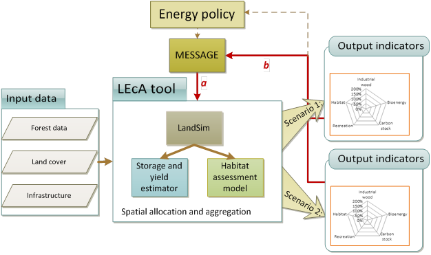
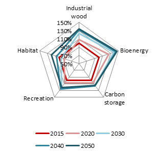
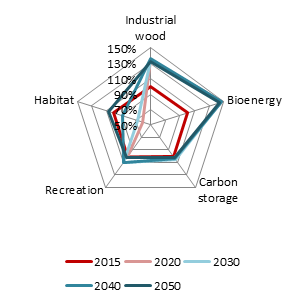

\[caption id="attachment\_2091" align="alignnone" width="626"\] Overview of the LEcA tool (adapted after Pang et al. 2017b). The LEcA tool includes the landscape simulator LandSim, the storage and yield calculator, and the habitat assessment tool. The ecosystem services can be assessed together. The red lines a and b are links under development and discussion, where results can be fed back to the MESSAGE model and in the next step again influence LEcA. Eventually, the insights can inform energy policy.\[/caption\]

Within the framework of the REEEM project, the case study was included in [Work Package 5 on Environment, Health and Resources](https://www.reeem.org/index.php/work-packages/), where multiple sustainability goals are addressed for gaining a comprehensive understanding of the system-wide implications of decarburization pathways. The case study of Lithuania intended to assess impacts on multiple ecosystem services of forest bioenergy options, as well as to take the first steps for model linking between an ecosystem service assessment tool, and an energy sector development model. In this way, the links between energy assessment and ecosystem services could be strengthened in a more integrated assessment, targeting to increase the sustainability of forest bioenergy strategies. The research was led by the [Environmental Management and Assessment (EMA) research group, KTH Royal Institute of Technology](https://www.kth.se/start/2.54128/tidigare-avdelningar/lwr/grupper/forskningsomraden/ema/research/forskning-research-1.53068?l=sv_SE_ER), in cooperation with contributors from several institutions.

### Trade-offs

Forests provide a multitude of ecosystem services, however it is often not possible to substantially increase the use of one of these without trade-offs with other ecosystem services. This is illustrated in Figure 10 (see below), where the development of five ecosystem services between the forest management strategies is shown for 2015-2050. The red line represents the state of the forest in the starting year 2015, while industrial wood and bioenergy yield for that year was derived from empirical data. The allocation of the total harvest between industrial wood and bioenergy feedstock followed Assumption Set 2a.

In both strategies, bioenergy showed the highest increase, followed by industrial wood. In Strategy **BAU (Business-As-Usual forest management strategy)**, the bioenergy yield increased gradually while in **Strategy INT ( more intensive forest management strategy)** it directly reached a high level that was more or less kept during the simulation period up to 2050. The yield of industrial wood followed a similar pattern. The difference resulted in overall lower carbon storage in Strategy INT, compared to BAU. The recreation area was overall larger in Strategy BAU. For the habitat networks, Strategy BAU led to a decline in the beginning of the period while it ended with an increase. In comparison, Strategy INT showed a similar pattern but the decrease in the first time steps was substantial. The trade-off diagrams thus point at the consequences of the higher extraction levels of industrial wood and bioenergy feedstock in Strategy INT, with impacts on the other three ecosystem services.

Strategy BAU

Strategy INT

- 
    
- 
    

Illustration of trade-offs between ecosystem services, applying Assumption Set 2a to the allocation of the total harvest into industrial wood and bioenergy feedstock.

You can find the full case study report [here.](https://www.reeem.org/wp-content/uploads/2018/12/5.4-Ecosystem-Services-case-study-report.pdf)
