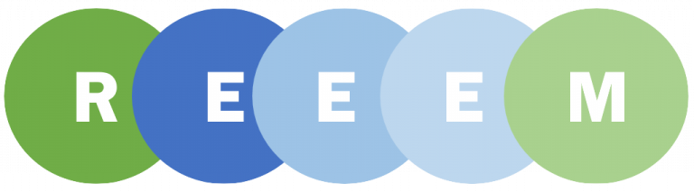

From April 15th - 16th 2019, the seventh and last General Assembly of the REEEM project will be held in Lyngby. At the General Assembly all involved project partners will come together to discuss their work. The upcoming General Assembly, hosted by the Technical University of Denmark, will be the last before the project is completed in July.

For this reason, the results of the different work packages will be presented and discussed at the meeting. The agenda's main focus is on the life after REEEM and how the results can be used after the project is finished.
