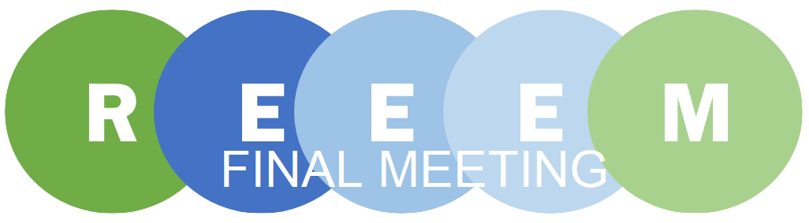

After three years, the REEEM project comes to an end by the end of July. For this occasion, the final meeting of the REEEM project partners will take place from July 15th – 17th in Brussels at the European Commission.

In three days, all partners come together to discuss the success of the project.

On day one, the preparations for the meeting will be made: The participants will collect internal results, discuss and prepare the project presentation for the European Commission. On the second day, commission officers from the European Commission are invited to the meeting, to talk about the project’s processing and results. On the third day, the participants will work on finalizing papers together.
