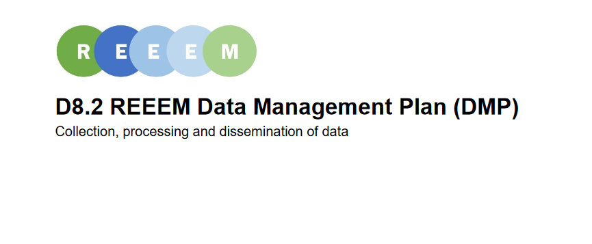

The Data Management Plan (DMP) constitutes a deliverable of the project. It aims at providing a clear picture of how the project manages data and metadata. The DMP describes the data management life cycle for the data to be collected, processed and/or generated by this Horizon 2020 project. One of the grand challenges of data-intensive science is to facilitate knowledge discovery by assisting humans and machines in their discovery of, access to, integration and analysis of, scientific data and their associated algorithms and workflows. The FAIR data principles are a set of guiding principles to make data _**F**indable, **A**ccessible, **I**nteroperable_, and _**R**eusable_ (FAIR). This research project uses these principles to improve the scientific work during the project and the dissemination of the project results.

The full DMP can be found [here. ](https://www.reeem.org/wp-content/uploads/2018/12/6.6-REEEM-Data-Management-Plan-DMP.pdf)
