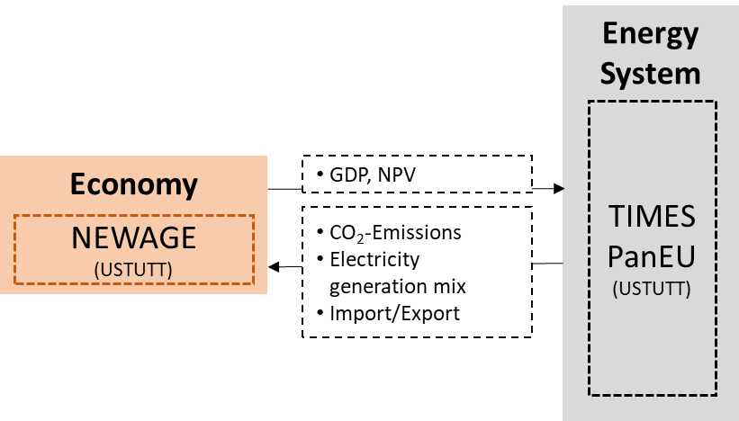

An energy transition implying deep fuel shifts and significant investments towards decarbonisation is likely to carry impacts on economies, in terms of GDP growth, job market, gains or losses in competitiveness, etc. This analysis is carried out with [NEWAGE](/newage/), a top-down, recursive dynamic general equilibrium model which finds the pare to point between different players in the economy in REEEM project. However, as much as the development of the energy sector has implications for the whole economy, conversely the whole economy (population, GDP and industrial growths) has impacts on the demand-supply equilibrium in the energy sector. To capture these cross-impact and to improve the technological foundation of economic modeling, a bi-directional, iterative link is established in REEEM between NEWAGE and the energy system model [TIMES PanEU](/times/) which is employed as an energy system optimisation model within the course of the project to analyse the role of different technologies in energy transition.

The main objective of this linkage is to assess the effect of economic variations such as GDP development and sectoral growth on energy demand in TIMES PanEU and feed the changes in the electricity supply technology mix and in the CO2 emissions back into NEWAGE.  The link between the two models is iterative to make sure that all the effects are taken into account in both of the models. The link is established based on the data exchange picturized below.

 Figure 1: The link between TIMES PanEU & NEWAGE

For the calibration process of the models, the EU Reference Scenario (European Commission, 2016) is calculated with TIMES PanEU and given to NEWAGE to determine the reference development of the economic growth of different sectors and GDP. After the sectoral match between the models, iteration process is initiated. The differences in terms of economic developments from results of the NEWAGE runs for the GDP and Gross Value Added (GVA) for the industrial sectors are compared. The ratio between the EU Reference Scenario & REEEM pathway runs is calculated and this development is reflected on the demand figures in NEWAGE. The process continues until the models reach the convergence. The link is established individually for all the pathways (REEEM, 2019) analyzed within the project. It is observed that due to declining GDP and industrial growth values calculated in NEWAGE according to the REEEM pathways, the final demand and final energy consumption computed in TIMES after the coupling result lower. It is also important to point out that the differences in total energy system costs between the model runs during the coupling process are not caused by economic effects but by the changing energy demand figures. Therefore, total energy system costs should not be compared between different scenarios or model runs.
