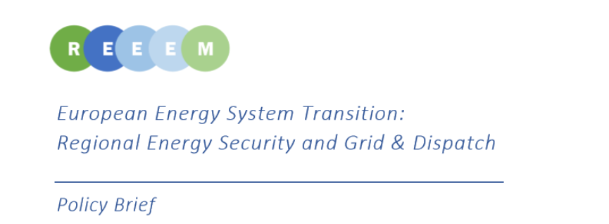

This Deliverable 6.4 composes the Policy Brief of the workpackage 6. Two case studies are considered to have a deeper look at certain regions and different modelling approaches for the transition pathways of European Union towards a low carbon society. It includes the main insights obtained in these case studies. It enlightens key conclusions based on the findings of the case studies.

The Policy Brief builds on the detailed analyses reported in [Deliverable 6.2 –Regional Energy Security Case Study Report](https://next.rl-institut.de/s/DozmwsExtg6WHiK#pdfviewer) and [Deliverable 6.3 – Grid and Dispatch Case Study Report](https://www.reeem.org/wp-content/uploads/2019/05/REEEM-D6.3.-Grid-and-Dispatch-in-SEE-Case-study-report.pdf).

The first case study focuses on the Baltics and Finland. The idea is to study the regional energy security considering the energy flow, especially with Russia, as a connection point for the flow between Europe. In this case study, the [MESSAGE](https://www.reeem.org/index.php/message/) model is used and the results of the [TIMES PanEU](https://www.reeem.org/index.php/times/) from Base and HighRES pathways (G. Avgerinopoulos and et al, 2018) are exploited.

The second case study focuses on South Eastern European (SEE) region invcluding five countries: Croatia, Bulgaria, Romania, Slovenia and Hungary. This case study verifies the feasibility of dispatch, calculated in TIMES PanEU, and analyses the influence of short-term variability on long-term investments and system configurations using [PLEXOS](https://www.reeem.org/index.php/plexos/) model for five countries in SEE. Again, the results of the Base and HighRES pathways of TIMES PanEU are also used as inputs to the PLEXOS model.

You can find the complete version of the [Deliverable here.](https://www.reeem.org/wp-content/uploads/2019/05/REEEM-D6.4_Policy-Brief.pdf)
