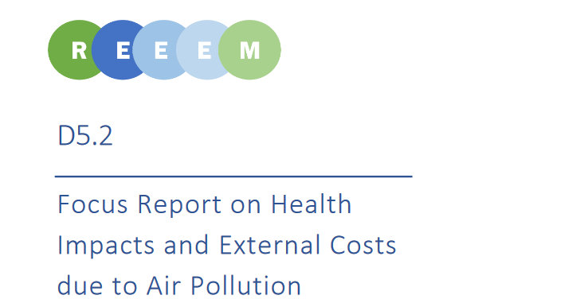

This [Deliverable 5.2 "Focus Report on Health Impacts and External Costs due to Air Pollution"](https://next.rl-institut.de/s/EjpzmScqKBKzCHe#pdfviewer) describes the methodology, main results and insights with regard to health and environmental impacts due to air pollution as an additional indicator for sustainable transformation pathways. By carrying out a comparative scenario analysis of three different pathways, which all feature ambitious GHG mitigation targets, the interactions of decarbonisation and air pollution control are studied, with one scenario having ambitious RES targets as an additional decarbonisation measure (HighRES) and the third scenario introducing costs of air pollution in the system’s optimisation to reflect impacts of air pollution control (Base\_DAM). Following the concept of the REEEM project, this allows for an integrated assessment of decarbonisation targets and air pollution control policies. For this purpose, the energy system model [TIMES PanEU](http://www.reeem.org/index.php/times/) is linked with the impact assessment model [EcoSense](http://www.reeem.org/index.php/ecosense/).

The deliverable describes the link between the two models and extracts key messages with regard to possible impacts of decarbonisation pathways on air quality. Additionally, [EcoSense](http://www.reeem.org/index.php/ecosense/) is compared to the more complex [EVA](http://www.reeem.org/index.php/eva/) model; both of these models are used to gain a better understanding of the associated uncertainties. Results indicated that country-specific RES targets may have negative effects on air pollution due to increased utilization of biomass. From the three considered scenarios, including costs of air pollution in the system’s optimization leads to the lowest external costs, providing benefits for society while still achieving the same decarbonisation targets. In this pathway, GHG emissions are also reduced earlier in time and at lower ETS CO2 prices. Overall, results from this study emphasize possible co-benefits of integrated policies that consider air pollution control and climate mitigation simultaneously.
