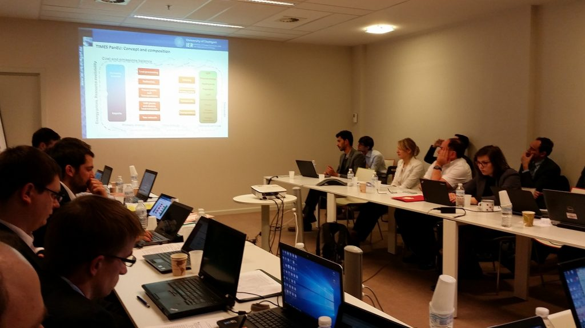

REEEM kick-off meeting was held at the “Science14” premises in Brussels 24th – 25th February.An internal consortium meeting was held the 1st day and the official kick-off meeting on the 2nd. On the 25th, a general introduction to the REEEM project was given by the project Coordinator. Next, all partners were informed about the administrative and financial procedures that will be followed during REEEM execution. The afternoon was used for work package presentations followed by discussions about the work to be carried out in each work package. REEEM kick-off meeting set the foundations for a successful project.

