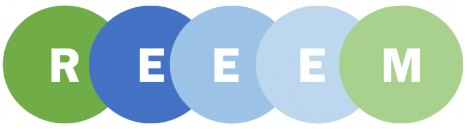

A new report was conducted by the REEEM consortium, in early 2018, covering aspects of integrated modelling assessment. Sustainable development has been high on the global agenda over the past couple of decades. The EU in particular appears to be at the leading edge of sustainable development with really ambitious targets been set, both mid and long term. One of the key components of sustainable development is the decarbonisation of the energy system. Moving towards an energy system with a significantly low carbon footprint can be a challenging task. Several factors need to be taken into account when different options are explored and the various trade-offs need to be identified. An energy system affects and is affected by a plethora of aspects and, therefore, its transition to a different pattern may have economic, social and environmental impacts.

The REEEM project aims at analysing how different technologies can impact the transition to a low carbon economy in the EU28+2 (Norway and Switzerland) by 2050. To do so, a suite of models is used, looking at different aspects (macroeconomics, energy system optimisation, LCA of energy technologies etc.) and on different scales spanning from pan EU28+2 to case studies covering either single countries or even municipalities. In many cases those models are soft-linked resulting in multi-modelling framework. This is performed by analysing the outcome of the aforementioned modelling framework applied on a number of pathways defined in the REEEM project.

For deeper information have a look at our [blog-entry](https://www.reeem.org/index.php/reeem-blog/). The full report will be online as soon as it is approved by the European Commission. We will announce that with a short news.
