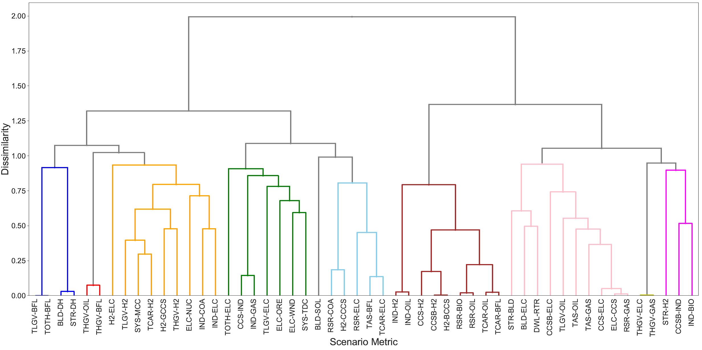

\[caption id="attachment\_2413" align="aligncenter" width="777"\] Figure X. Representation of clusters in a dendrogram, using a hierarchical clustering approach. Clusters are built from the bottom-up, with closely related metrics first pairing together, then the pairs being paired, until all clusters form a single cluster. This figure shows 10 specific clusters, shown by different colours.\[/caption\]

A new paper was published online in April 2019 by the journal "[Energy Strategy Reviews](https://www.journals.elsevier.com/energy-strategy-reviews)" based on REEEM research. Titled [_"Technology interdependency in the United Kingdom's low carbon energy transition"_](https://authors.elsevier.com/sd/article/S2211467X1930029X), the paper sets out to explore the conditions in which different low carbon technologies are chosen and deployed in future energy systems. In this research, we use a clustering algorithm to explore, across many hundreds of scenarios, whether technologies tend to be deployed with other technologies (due to some dependency), in competition with other low carbon technologies, or irrespective of other factors (independent).

We find that technologies compete in some instances, often on costs, group together because they co-depend on each other, or emerge under all conditions, as robust options. Crucially, the broader scenario framing around carbon capture and storage (CCS) availability and climate policy stringency strongly influences these interdependencies. We conclude that understanding relationships between technologies is important as it provides useful information as to why technologies are deployed, based on factors other than costs.

This paper builds on an earlier Deliverable under the REEEM project, published in February 2018 titled [_"Coevolution and competition of technologies in a low carbon system"_](https://www.reeem.org/wp-content/uploads/2018/07/REEEM-D2.4-Technologies-in-Low-Carbon-System.pdf). In particular, it extends the analysis to use a hierarchical clustering algorithm to systematically determine technology dependency. Some illustrative results are shown in the dendrogram above, highlighting how different model metrics cluster.

The full paper can be found [here](https://authors.elsevier.com/sd/article/S2211467X1930029X).
