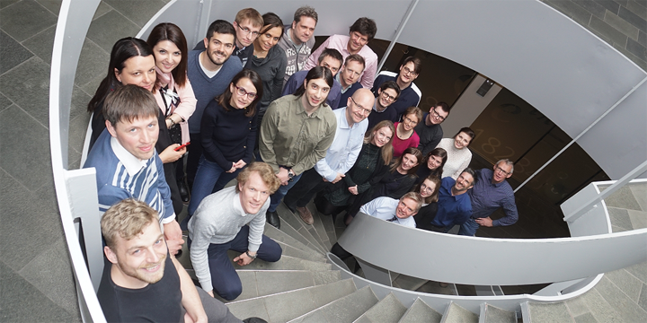

 Participants of the GA in Copenhagen.

Yesterday, the last General Assembly (GA) of the REEEM project has started. It is the last occasion for the project partners to meet, before the final meeting in July in Brussels.

During the two days of the GA, participants from the eleven project partner institutions finalize the work in the project, discuss and finish the REEEM product, prepare the final meeting in July and collect contributions for the upcoming [Energy Modelling Platform for Europe Conference  2019 (EMP-E 2019)](http://www.energymodellingplatform.eu/home-emp-e-2019.html#) in October.

Today, the participants work actively in breakout groups. Topics are – among others – the fusion of the REEEMgame and [Open Source energy Modelling Base for the European Union (OSeMBE)](https://www.reeem.org/index.php/osemosys/), the Households disaggregation, which means data disaggregation for models and a coupling of the Life Cycle Assessment and [TIMES](https://www.reeem.org/index.php/times/)\-PanEU models.

Moreover, the [Deliverable D1.2 b](https://www.reeem.org/index.php/deliverables/), the Integrated Impact Report, is processed in one breakout group.
