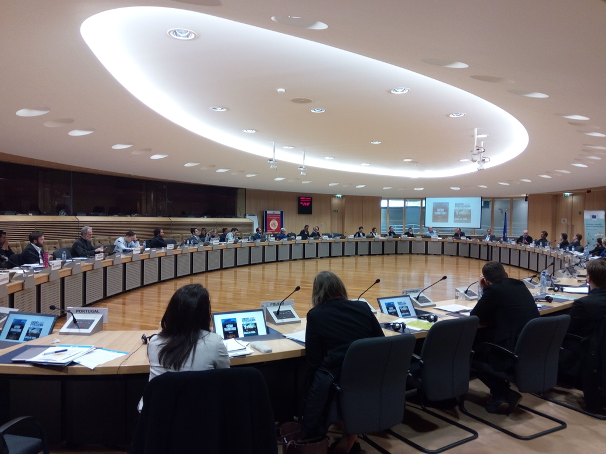

On April 20th, the workshop 'New narratives of Energy and Sustainability', organised by the European Commission's Joint Research Centre within the Horizon 2020 project MAGIC (Moving Towards Adaptive Governance in Complexity: Informing Nexus Security), took place at the Commission's headquarters in Brussels.

The workshop is part of an Inspirational Workshops Series. Horizon 2020 modelling project REEEM participated and contributed to the round table on the need for debunking myths in the definition of narratives for the future of the EU energy system. Amongst others, aspects regarding the necessity of soft-linking sectorial approaches, joining qualitative and quantitative elements (as in the 'Quantitative story-telling' approach) and including social behaviour as an input were discussed. The definition of a process to create internally consistent storylines and pathways for the EU energy system is one of the core activities of REEEM project.

Link to MAGIC website: [http://magic-nexus.eu/](http://magic-nexus.eu/)

