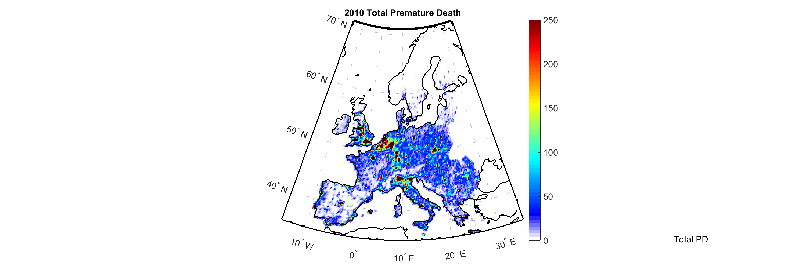

This paper brings together different modelling groups across Europe and the United States to calculate mortality and morbidity due to air pollution and their economic costs on the society. We use the Economic Valuation of Air Pollution (EVA) model to estimate health impacts of air pollution using data from fourteen models and establish an uncertainty of these estimations due to differences in models by keeping the emissions and the boundary conditions same among all the models.

Results show that differences in chemistry and transport models can lead to a factor of three difference in model estimates of mortality and morbidity, which should be considered in particular in policy applications. The results also show that the domestic anthropogenic emissions make the largest impacts on premature deaths on a continental scale, while foreign sources make a minor contribution to adverse impacts of air pollution.  
EVA system is one of the key models in the REEEM project for the calculation of unit costs of emissions in the different European countries, focusing in particular to the energy sector. These unit costs will serve to establish different scenarios to be used by the energy system models in the project, therefore it is important to know the uncertainties lying in these estimates.

The full paper can be downloaded from the open-access [Atmospheric Chemistry and Physics journal](https://www.atmos-chem-phys.net/18/5967/2018/).
