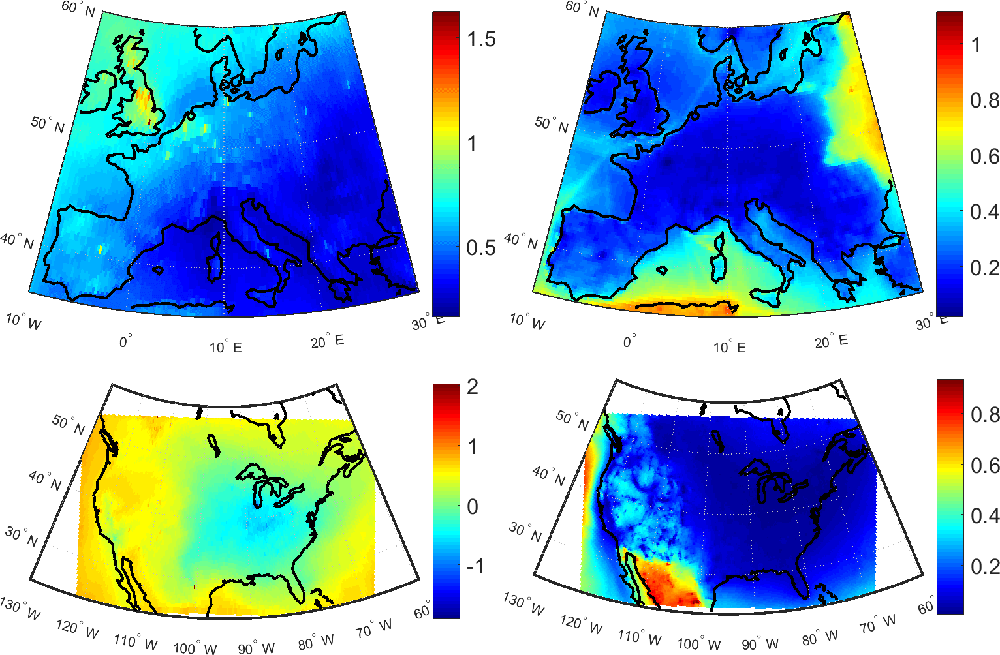

This paper investigates the impacts of local versus foreign emissions to the air pollutant concentrations over Europe and North America. We have employed an approach called the Response to Extra-Regional Emission Reductions (RERER), in order to quantify the differences in the strengths of non- local source contributions to different species among the different models. We found large RERER values for ozone (O3) over both Europe and North America, indicating a large contribution from non-local sources, while for particles (PM2.5), low RERER values reflect a predominant control by local sources. We have also identified a distinct seasonal variation in the local vs. non-local contributions has been found for both O3 and PM2.5, particularly reflecting the springtime long-range transport to both continents.

The results point out that depending on the pollutant, local emission reduction strategies may not always help in achieving better air quality, therefore decreased impact on the human health and the environment.

The full paper can be downloaded from the open-access [Atmospheric Chemistry and Physics journal](https://www.atmos-chem-phys.net/18/8929/2018/).
