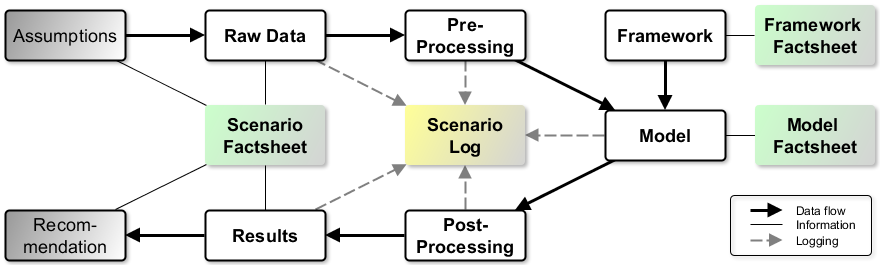

Transparent modelling concept © Reiner Lemoine Institut | CC BY-SA 4.0.

In this article we apply the transparency checklist methodology by Cao et al. to a case study to evaluate the degree of transparency in energy system modelling. We use a recent case study conducted by the Reiner Lemoine Institut that analyses heat and electricity supply in a German region.

An analysis of the questions of the transparency checklist indicates that different issues are addressed: transparency, reproducibility and quality. The completed checklist with answers regarding the case study and its supplementing materials shows that a large majority of the transparency (93%) and reproducibility criteria (73%) could be satisfied. However, only a smaller proportion (47%) of the questions categorised as quality criteria could be answered satisfyingly. A total of 31 out of 45 checklist questions are answered (69%). More than half (53%) of all questions were answered in the introduced framework, model and scenario fact sheets on the OpenEnergyPlatform. The gaps in answering the checklist (e.g., documenting assumptions, uncertainties, and validations) can be closed by an enhancement of the fact sheets and additional tools like the presented scenario log. We conclude that supplementing a final report or study with the presented fact sheets improves good scientific practice significantly while we identified existing weaknesses.

For more information, you can find the full paper [here](https://www.sciencedirect.com/science/article/pii/S2211467X18300828?via%3Dihub).
