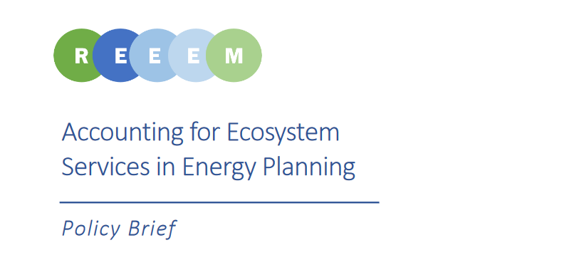

The Policy Brief on accounting for ecosystem services in energy planning provides policy recommendations based on a detailed analysis focusing on Lithuania reported in [Deliverable 5.4 – Ecosystem Services Case Study Report](https://www.reeem.org/wp-content/uploads/2018/12/5.4-Ecosystem-Services-case-study-report.pdf). The case study assessed impacts of alternative forest management strategies on multiple ecosystem services (bioenergy feedstock, industrial wood, carbon storage, recreation and habitat that supports biodiversity), as well as developed and discussed linking between an ecosystem service assessment tool and an energy systems model in order to integrate ecosystem services in sustainability assessment of energy policy and related forest bioenergy options. Based on the results of the case study, the following policy recommendations were drawn:

- Apply a bi-directional and iterative process when formulating National Energy and Climate strategies, so that local constraints and availability of resources are taken into account;
- Support the process by applying the tools that can bring ecosystem services consideration in energy planning;
- Give sufficient focus to forest management strategy as this is a crucial linkage between forest biomass extraction and other ecosystem services.

You can find the full Policy Brief [here.](https://www.reeem.org/wp-content/uploads/2018/07/REEEM-D5.5a-Policy-Brief.pdf)
