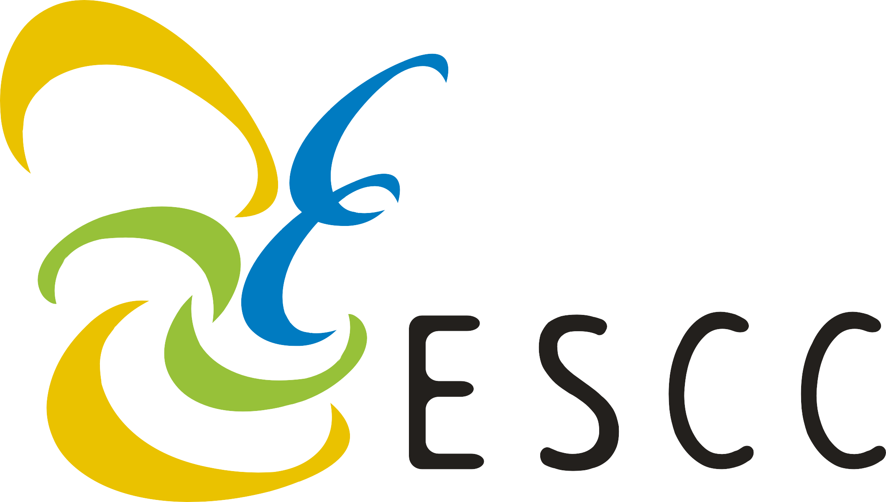

From June 3rd to 7th 2019, the REEEM partner from [Energy Institute Hrvoje Pozar (EIHP)](http://www.eihp.hr/) will participate in the 6th International Conference on "Energy, Sustainability and Climate Change" in Chania, Greece. For EIHP, Martina Mikulić, Dražen Balić and Ivana Milinković Turalija will participate in the conference.

In Session 6 "Power Systems - Renewable Energy", they will present the REEEM [case study on Grid and Dispatch in South Eastern Europe](../uploads/2019/05/REEEM-D6.3.-Grid-and-Dispatch-in-SEE-Case-study-report.pdf).

The International Conference on Energy, Sustainability and Climate Change is a platform for experts in the fields of energy, sustainability, climate change, optimization, and computational methods to discuss their recent researches and topics.

More information and the full programme of the conference can be found [here](http://escc.uth.gr/).
