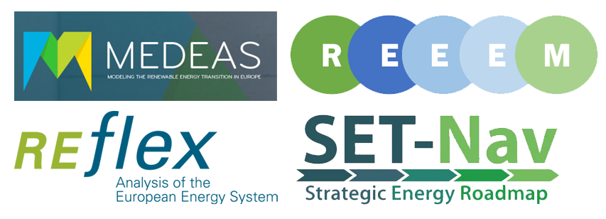

On November 6th, REEEM took part in the 3rd [H2020 Projects](https://ec.europa.eu/programmes/horizon2020/) Clustering Workshop on Energy System Modelling, held at INEA premises, in Brussels. Here, eight projects (REEEM, [SET-Nav](http://www.set-nav.eu/), [MEDEAS](https://www.medeas.eu/), [REflex](http://reflex-project.eu/), [Plan4RES](https://www.plan4res.eu/), [MAGNITUDE](https://www.magnitude-project.eu/), [Planet](https://www.h2020-planet.eu/) and [SPINE](http://www.spine-model.org/index.htm)) discussed with [INEA](https://ec.europa.eu/inea/en/welcome-to-innovation-networks-executive-agency) and the European Commission's DG Research and Innovation and DG Energy ways to increase the collaboration between funded actions and to extract joint messages on energy transitions to be conveyed to policy makers.

The four projects funded under LCE21-2015, REEEM, SET-Nav, MEDEAS and REflex presented the outcomes of their long-term collaboration, for the new projects to build on them. The [Energy Modelling Platform for Europe (EMP-E)](http://www.energymodellingplatform.eu/home-emp-e-2018.html) was confirmed as the main platform for collaboration and sharing of views. All projects submitted there will contribute to the next meeting of EMP-E, likely to occur in November 2019. Other relevant outcomes concern the sharing of model documentation and data for increased transparency, the collection of scenarios modelled across the projects as high-level narratives and the agreement on delivering joint policy documents. The projects also presented the European Commission with their views on potential measures to facilitate collaborations.
