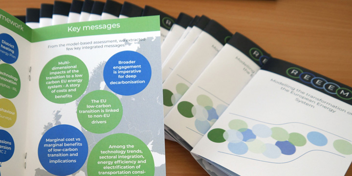
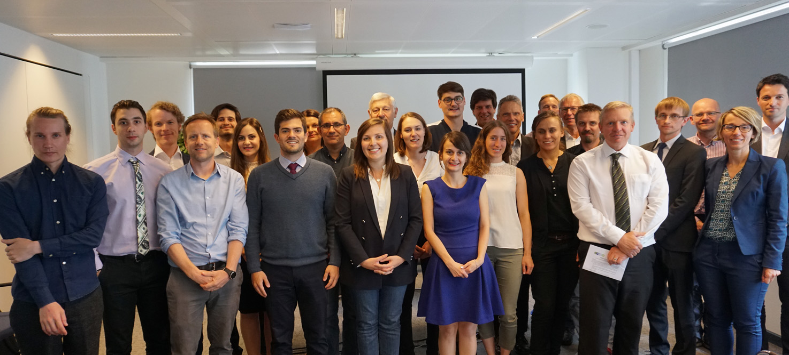

Mascha Richter and Ludwig Hülk participated in the final project meeting in Brussels in July 2019 and presented the public relations work and the project database developed by the RLI.

With the completion of the EU research project REEEM, the RLI has published the majority of the project results with open licenses. This includes [all project reports](https://zenodo.org/communities/reeem/) that are now available via Zenodo with DOI as well as [various model data stored on the OpenEnergyPlatform (OEP)](https://openenergy-platform.org/dataedit/view/scenario). The model data are both the input parameters and the result data of the individual models. Special emphasis has been placed on providing the data with rich metadata that follow [the FAIR Data Principles](https://www.go-fair.org/fair-principles/).

In cooperation with the project partner TOKNI from the Faroe Islands, the main project results were summarized in [a small-format brochure](https://www.reeem.org/wp-content/uploads/2019/09/REEEMbrochure.pdf).

