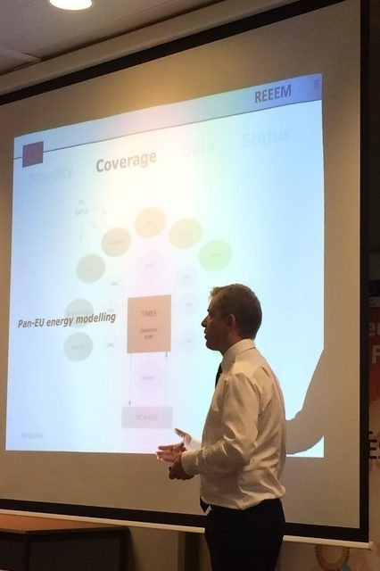

On April 26th-27th, the first modelling Workshop of the REEEM project was held in Stockholm, at KTH Royal Institute of Technology.

The partners of the Consortium presented the 17 models involved in the project, and studied and worked out the linkages between them. The Workshop led to the elaboration of the Pilot Case Study, first of the numerous pathways to be defined during the duration of REEEM.

[Project Manual and Communication Plan](../uploads/2017/04/REEEM-D8.1-and-D7.5.pdf)
