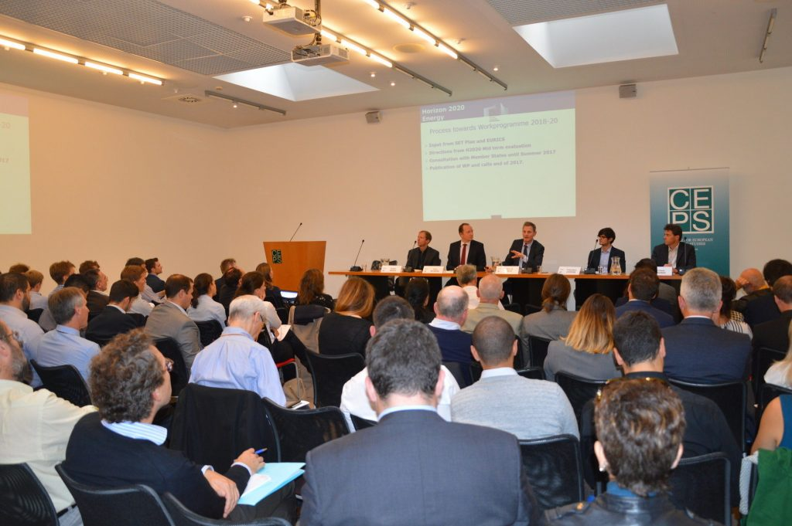

On September 28th, REEEM was invited to the stakeholder kick-off event of LCE21 SET-Nav project, held in Brussels at CEPS premises, under the title: 'Revitalising the SET-Plan: The Role of Innovation in Transforming the Energy System'.

Representatives of REEEM from KTH and KIC InnoEnergy participated to the panel discussion about the points of view and possible contributions of modelling projects, scientific research and practitioners to the implementation of the SET-Plan.

Agenda is available [HERE](https://www.reeem.org/wp-content/uploads/2017/11/Agenda.pdf)

