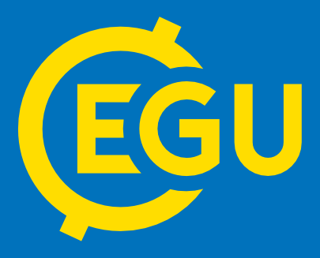

On April 10th, at the European Geosciences Union General Assembly 2018, in Vienna, Austria, Francesco Gardumi on behalf of the REEEM Consortium gave a presentation on 'Integrated impact assessment of decarbonisation pathways for the EU: insights from the REEEM project'. The presentation took place in the session dedicated to 'Energy and environmental systems interactions - Policy and modelling'. It focused on methodological challenges and solutions for integrated modelling currently under discussion in the project.

This intervention was one of several dedicated to Integrated Assessment Modelling techniques and applications. The EGU General Assembly takes place every year in Vienna and gathers more than 10000 researchers from all over the world on themes spanning from geosciences, to modelling of the Nexus between sectors and use of resources. Three years ago, a session was created, entirely dedicated to Energy and the Environment.

The presentation can be downloaded [here](../uploads/2018/04/Gardumi-et-al_EGU2018.pdf).

Link to the [abstract](https://meetingorganizer.copernicus.org/EGU2018/EGU2018-17535.pdf)
