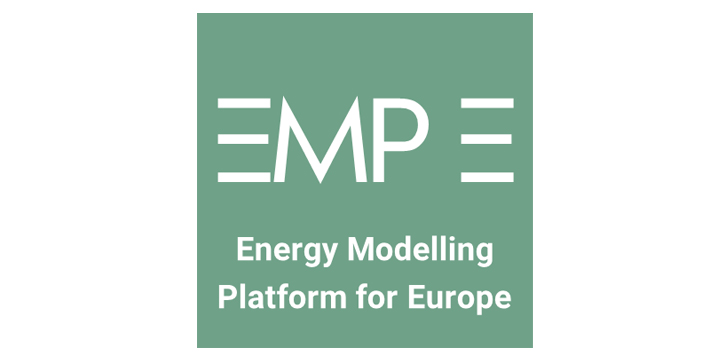

As a closure to their activities, the REEEM project and the [SET-Nav project](http://set-nav.eu/), funded by the Horizon 2020 Low-Carbon Energy call 2015, will co-chair a session on the modelling of Paris Agreement pathways at the Energy Modelling Platform for Europe (EMP-E) 2019. The session will be structured as a discussion between representatives of the European Commission, the audience and representatives of four projects funded under the same call, MEDEAS, REflex, REEEM and SET-Nav. The challenges of assessing quantitatively the impacts of high decarbonisation pathways for the EU and the related policy insights drawn by the projects will be shared and compared. The plenary session is designed to fulfil the original scope of the EMP-E: created by the REEEM project in 2017 and culminating in annual events now co-organised by numerous EU-funded actions, EMP-E aims to provide a digest of European energy models and insights for the European Commission and for researchers across Member States.

More information on the registration and the full EMP-E-agenda can be found [here](http://www.reeem.org/index.php/2019/04/17/emp-e-2019-now-open-for-registration/).
