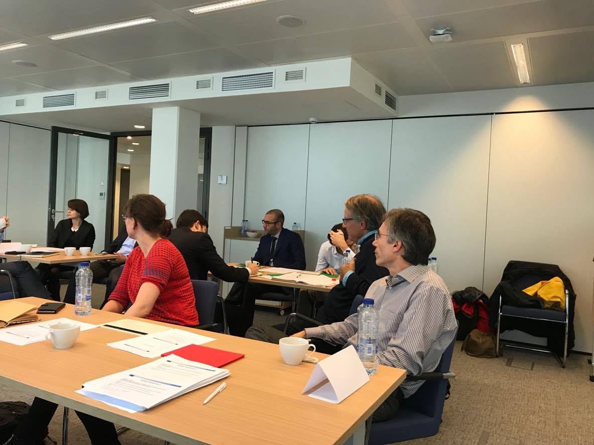

Organised jointly by KTH, University of Stuttgart and University College London, the REEEM Stakeholder Workshop on pathway definition was held in Brussels, on October 6th.

19 invitees from the academia, research centers, private consultancies as well as the EC participated actively in 4 work sessions. The main theme of the workshop was the definition of long-term, energy transition and decarbonisation pathways for the EU, to be analysed with the multi-sectoral modelling framework set up in the REEEM project.

The core of the workshop consisted in four work sessions, organised in the format of a WARP conference. In the first two sessions, a base pathway was agreed upon by the participants and key assumptions collected for it. In the last two sessions, potential deviations from the base pathway and disruptions were suggested by the participants.

The agenda is available [HERE](http://www.reeem.org/wp-content/uploads/2017/11/REEEM-1stWS_agenda.pdf).

