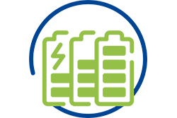

####  - Exploring the role of energy storage in the energy transition and identifying key actions to improve and attain this role.

**Energy storage** has a crucial role to play in the energy transition towards a low carbon EU society, by enhancing the reliability, flexibility and security of the European energy system. Energy storage could be particularly significant in the near future, given the ambitious targets for the development and deployment of renewable energy. We expect energy storage to be a key component in supporting the renewable energy integration into the EU energy grid.

**The REEEM roadmap** explores the potential role and position of energy storage in the transition of the European energy system, by shedding light on different **applications**. The roadmap identifies five main applications, namely grid-scale, behind-the-meter, off-grid, mobility and thermal. And it further characterizes market and technologies for each application in order to highlight the current status of the energy storage markets and to explore **innovation potential** in three categories of services (which enhance the business cases of energy storage), technologies (which improve the system performance) and business models (which lead to successful integration and cooperation of actors).  

The roadmap’s **findings** unveil the market challenges and drivers of different storage applications in the current and expected market environment, based on plausible scenarios. The roadmap give the keys to policymakers and investors to take decisions that can lead to competitive and timely actions accelerating the development of energy storage.

To complement the energy storage roadmap, the REEEM **Innovation Readiness Level** (IRL) report assesses all the dimensions affecting the innovation readiness of a technology and its potential and risk in accessing the market. To do so, we have assessed the five dimensions of the Innovation Readiness Level, namely technology readiness level, Intellectual property (IP) readiness level, market readiness level, consumer readiness level and society readiness level. And this assessment has been done throughout five storage technologies: Lithium ion batteries, flow batteries, compressed air energy storage, supercapacitors and hydrogen.

The **findings** illustrate potentials and risks of different storage technologies to access the market. It also suggests improvements in the innovation processes of these technologies to accelerate their access to the market. The results provide suggestions for policymakers, investors and industries about strengths and drawbacks of the **innovation processes** of the studied technologies.

**Download the reports:** [**D2.1a "Technology Roadmaps"**](https://www.reeem.org/wp-content/uploads/2018/09/D2.1a.pdf) and [**D2.2a "Innovation Readiness Level assessments"**](https://www.reeem.org/wp-content/uploads/2017/09/REEEM-D2.2a.pdf)
