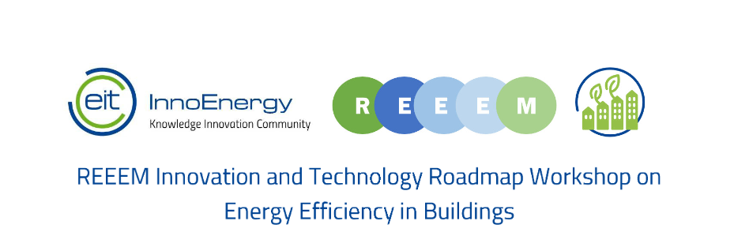

On March 19th 2019, the third REEEM Technology and Innovation Roadmap Workshop on Energy Efficiency in Buildings will take place at EIT InnoEnergy in Brussels.

Energy efficiency is at the top of the EU priorities for the Energy Union, as stated in the Clean Energy Package for all Europeans as “Energy Efficiency First”. Therefore, the objective of the REEEM roadmap is to explore innovative methods and technologies that enable reaching EU energy efficiency targets for 2030. It further explores the road toward the full renovation of building stocks by 2050. Several recommendations and actions are provided in accordance.

During this **REEEM Technology and Innovation Roadmap Workshop on Energy Efficiency in Buildings**, the roadmap’s and its preliminary findings will be presented in the morning session, you will be invited to identify innovative technology and policy scenarios that could support Europe toward its full decarbonization of building stocks by 2050, during the roundtable session.

**For the official invitation and the complete agenda, please see [here](http://www.reeem.org/wp-content/uploads/2019/02/Invitation_and_Agenda_EIT_Workshop.pdf).**

**If you want to participate, please register [here. ](https://docs.google.com/forms/d/e/1FAIpQLSern0u-fbbBIRJ_kOqksFhDODZJ3aFIEuoTM45YvsqMIoIPLQ/viewform)**
