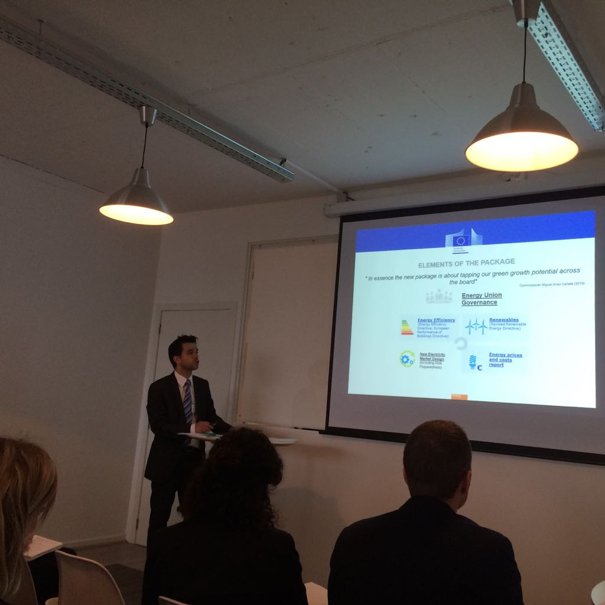
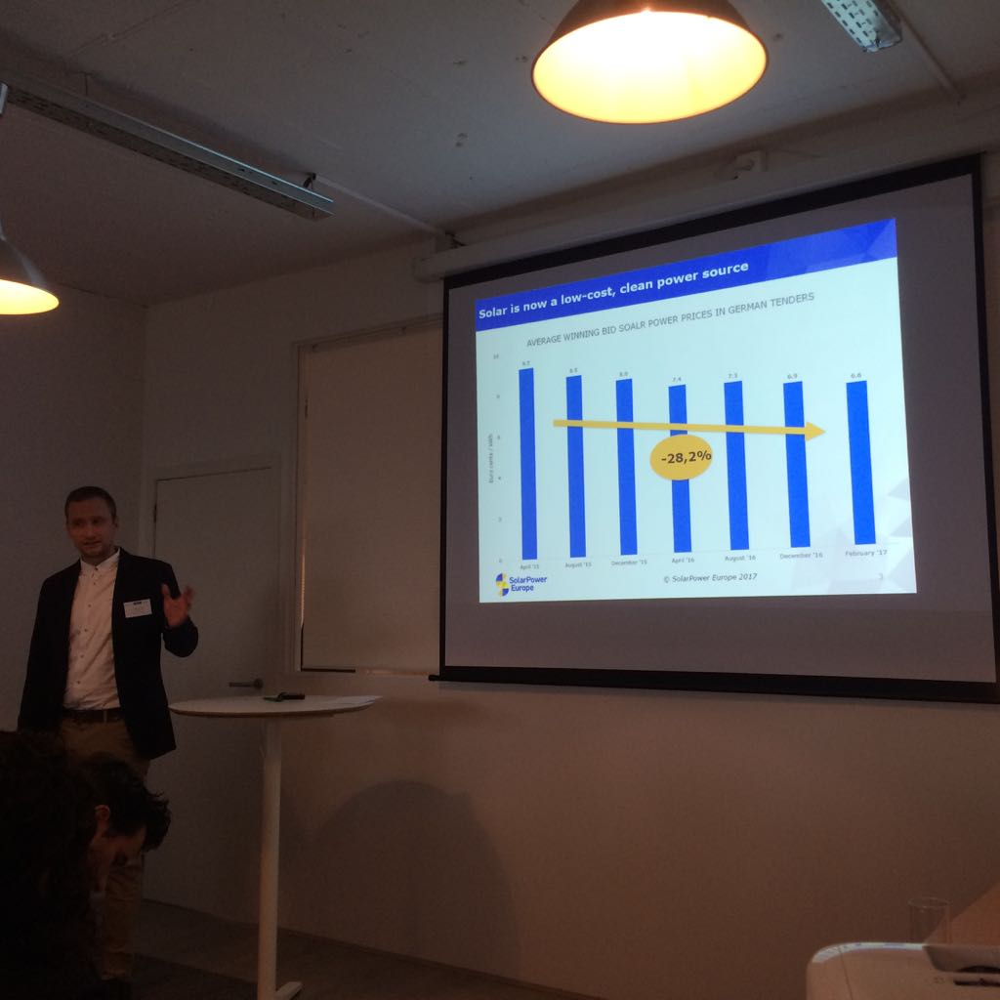
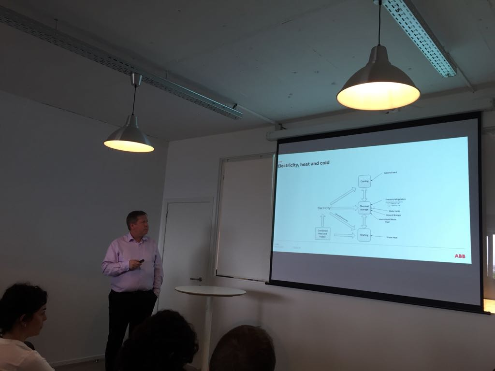
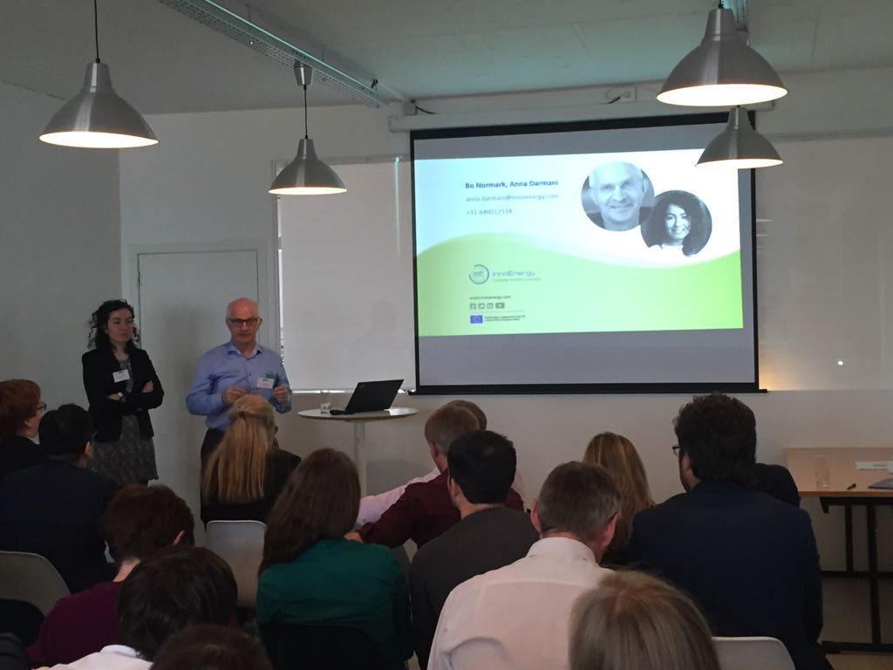
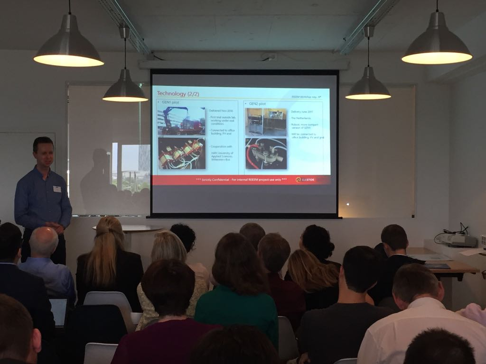
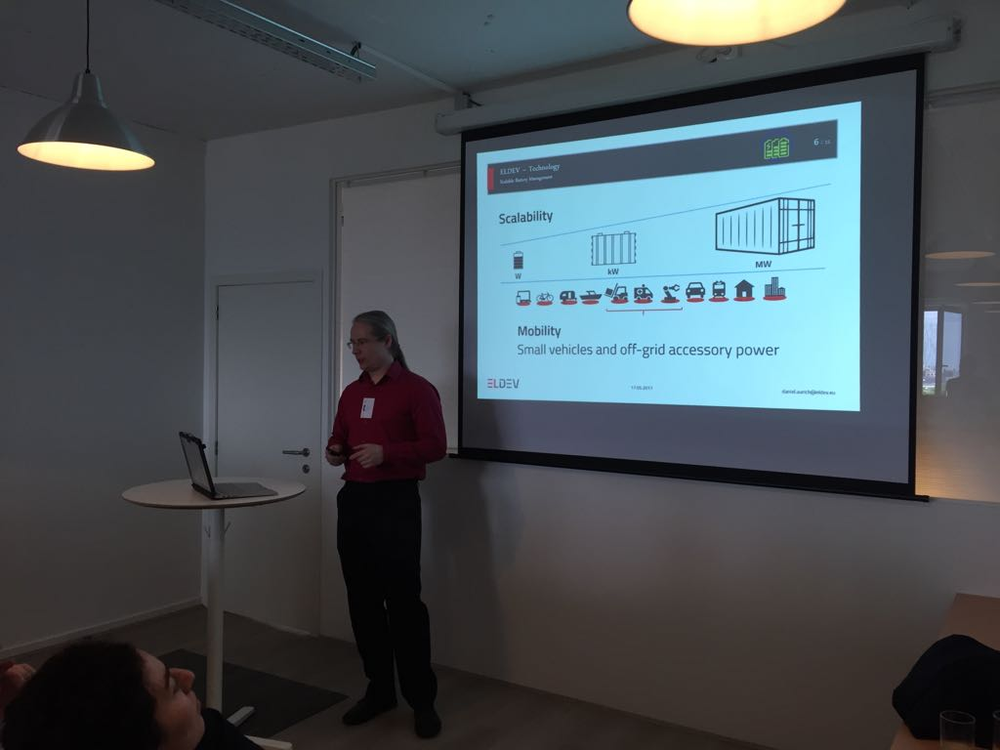
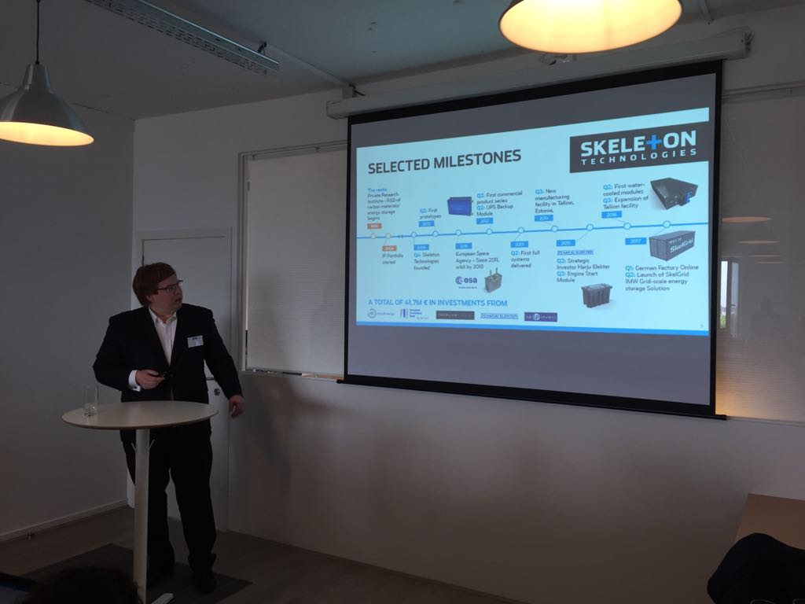
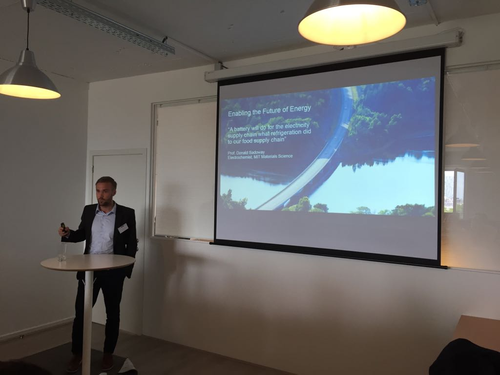
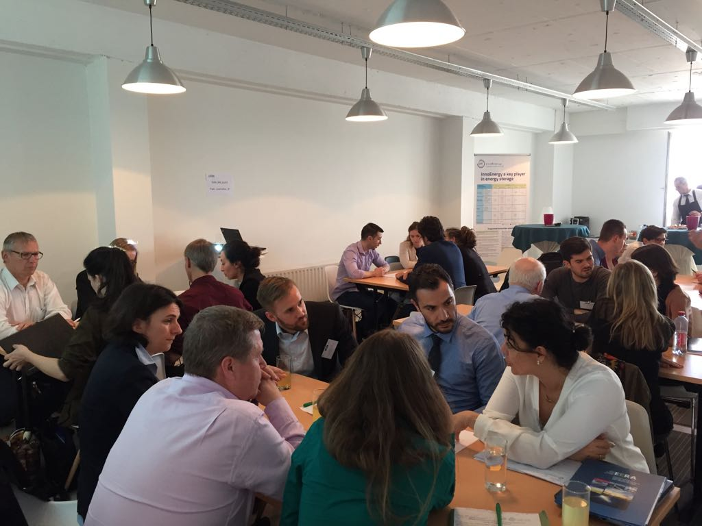
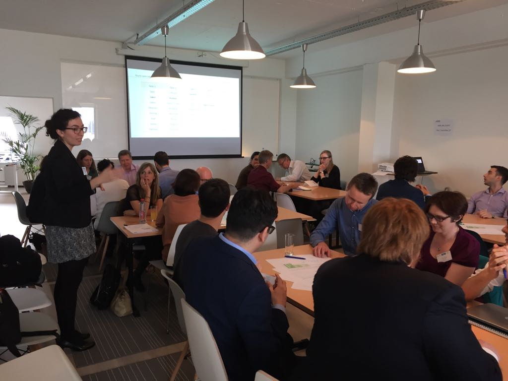

On the 19th of May 2017, the REEEM project has hosted its first **REEEM Technology and Innovation Roadmap Workshop on Energy Storage Applications**, in Brussels.

Energy storage is at the top of the EU priorities for the Energy Union, as stated in the Clean Energy Package for all Europeans. Therefore, the objective of the REEEM roadmap is to explore different applications of energy storage and, identify and prioritize the criteria that lead to competitive and innovative actions for the application of the energy storage.

During the workshop, the Roadmap’s and its preliminary findings have been presented by **Anna Darmani** and **Bo Normark**, from InnoEnergy and the participants have been invited to contribute to the identified criteria and developed scenarios during roundtable session.

We had the chance to welcome a representative of the European Commission, **Dimitrios Sofianopoulos**, policy officer at DG ENER, Unit C2, a policy analyst from SolarPower Europe, **Thomas Döring**, a representative of the industry with **Mikael Dalhgren** from ABB, and finally four start-ups dealing with energy storage. All presentations are available below.

**Agenda**

[REEEM Workshop on Storage](../uploads/2017/05/REEEM-Workshop-on-Storage_Agenda.pdf)

**Pictures**

**Picture Metadata**

Author: Louise Coffineau Copyright: InnoEnergy License: Creative Commons Attribution 4.0 International ([CC BY 4.0](https://creativecommons.org/licenses/by/4.0/)) Instructions: You are free: To Share, To Create, To Adapt; As long as you: Attribute! Citation: © [InnoEnergy](http://www.innoenergy.com/) / CC BY 4.0

**Presentations**

[Dimitrios Sofianopoulos - The EU energy policy through the ''Clean Energy for All Europeans'' package](https://cloud.rl-institut.de/index.php/s/5rlqGlbnRW7oSbo)

[Thomas Doering - Solar & Storage: How can the EU framework truly empower consumers?](https://cloud.rl-institut.de/index.php/s/G5uob2KPvqQLyed)

[Anna Darmani, Bo Normark - Energy Storage Application / REEEM Innovation and Technology Roadmap](https://cloud.rl-institut.de/index.php/s/LG1XerzEyuk8zRO)

[Wiebrand Kout - Elestor / Company, technology, impact & opportunities](https://cloud.rl-institut.de/index.php/s/QV6KhTTw9Thmpl3)

[Daniel Aurich - ELDEV / Smart Storage Solutions](https://cloud.rl-institut.de/index.php/s/EllPopZ4qkA5WqE)

[Dr. Mikael Dahlgren - How could EU become the major actor in the energy storage area](https://cloud.rl-institut.de/index.php/s/dqPvA6A0wu7tWGh)
