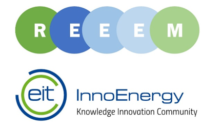

The second **REEEM Technology and Innovation Roadmap Workshop on Renewable Energy Integration** will take place on the **17th of April, **at the EIT InnoEnergy premises. In the workshop we aim to answer ‘**what are the technological and market solutions necessary to achieve the EU ambition for 2050?’**.

Renewable energy has the potential to play a big role in the transition pathways toward a European low carbon society. In accordance, ambitious targets have been set for development and deployment of renewable energies in the last decades. To achieve this ambition, there is a need for technological innovation and sustained market supports for the development of the renewable energies, as well as for finding approaches to fully integrate renewable energies into the energy system efficiently and effectively. The REEEM roadmap will address these issues by thorough analysis of three groups of renewable energies, namely wind, solar and ocean energies. The roadmap’s findings will be discussed and consolidated during the workshop.

Please find the agenda [**Here**](http://www.reeem.org/wp-content/uploads/2018/03/REEEM-Workshop-Agenda-II.pdf) and if you are interested to attend, contact us on [anna.darmani@innoenergy.com](mailto:anna.darmani@innoenergy.com) or [louise.coffineau@innoenergy.com](mailto:louise.coffineau@innoenergy.com).
