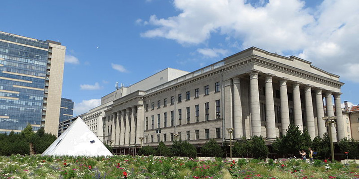

Lithuanian Energy Institute (LEI) invites to a workshop REGIONAL ASPECTS OF EUROPEAN ENERGY TRANSITION which will be held on **June 4th from 12:00 to 16:00** in the **Martynas Mažvydas National Library of Lithuania** (Gedimino 51-305, Vilnius, Lithuania).

This workshop is a part of the REEEM project, which is financed by the European Commission through the program Horizon 2020. The project aims to gain a clear and comprehensive understanding of the system-wide implications of energy strategies in support of the transition to a competitive low-carbon EU society.

The workshop is envisaged as an interactive session of energy experts and policymakers from the Baltic region. The topics of the workshop include such issues as district heating in cities, energy security, and energy poverty.

**To attend the workshop, please register [here](http://bit.ly/reeem).**

For the full workshop agenda, please take a look [here.](../uploads/2019/05/Workshop_agenda_Vilnius_June_4.pdf)

##### © Image: [Bernt Rostad](https://www.flickr.com/people/67975030@N00) from Oslo, Norway, [Martynas Mažvydas National Library of Lithuania (9651319245)](https://commons.wikimedia.org/wiki/File:Martynas_Mažvydas_National_Library_of_Lithuania_(9651319245).jpg), cropped, [CC BY 2.0](https://creativecommons.org/licenses/by/2.0/legalcode)
