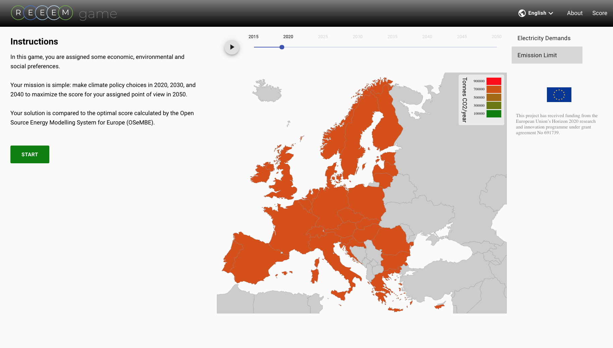

REEEMgame is a learning simulation of how the future will look depending on how the player decides to act. The goal is to maximize the score in 2050, considering the social, environmental and economic dimensions decade by decade.

The game aims to let the player interactively discover how (policy) decisions might affect the development of the European electricity sector in the transition to a low carbon system. At three points in time (2020, 2030, 2040) decisions need to be made concerning the emission reduction pathway, the investment in Renewable Energy Technologies, and the trans-border electricity transmission between European countries.

REEEMgame features data about e.g. electricity demands and emission limits in Europe over time and the player can review the data in order to make good decisions.

All partners within the REEEM project have contributed to the learning simulation by providing feedback throughout the development process and the game will be updated throughout the project.

REEEMgame is part of the [Stakeholder Engagement and Dissemination work package](/work-packages/) in the REEEM project. The game is based on [OSeMBE](http://www.osemosys.org/osembe.html), which is the open source energy model base for the European Union.

Visit the current version: [https://reeemgame.org](https://reeemgame.org)

Source code for the REEEMgame [https://github.com/ReeemProject/reeemgame](https://github.com/ReeemProject/reeemgame)
