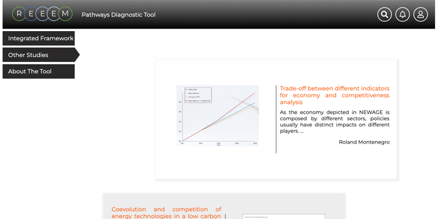
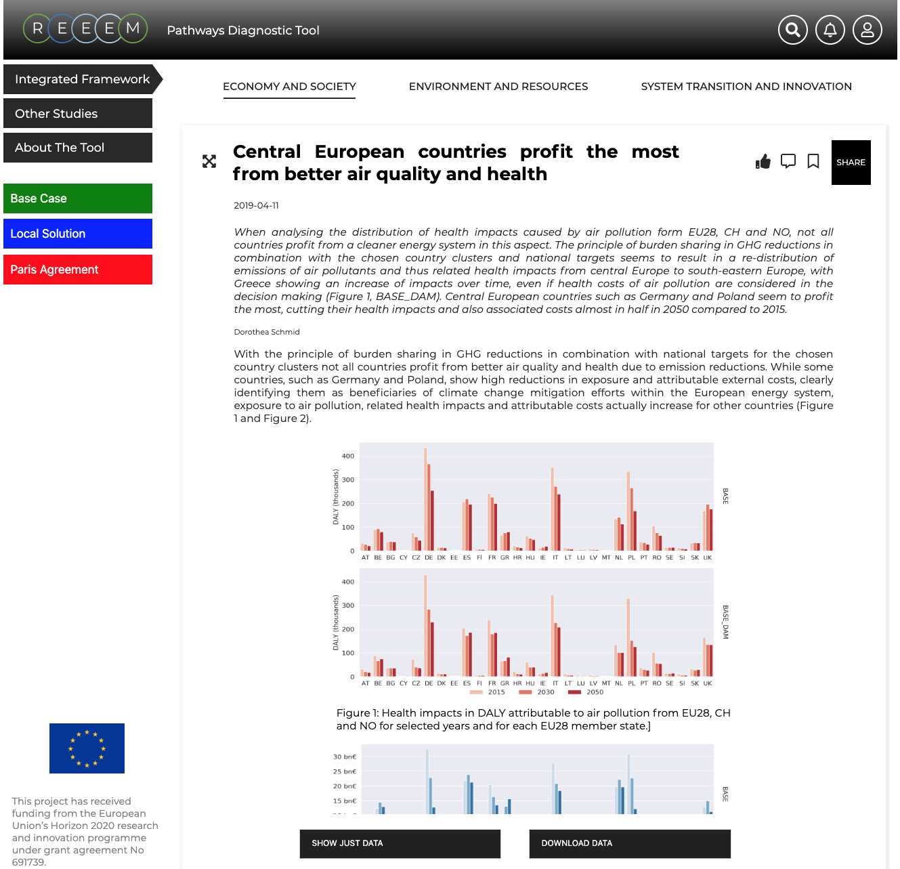

The REEEMpathways tool is an article-based open access online tool to visualise the results and key messages of the project in order to further enable stakeholder interaction. The tool is populated by data stored in the [REEEM Pathways Database](../uploads/2019/05/REEEM-D6.5.pdf) and provides public access to modelling insights, input data, and pathway assumptions from the project.

The user interface is designed with an emphasis on organise and visualise model data. A number of developed features enhance usability and accessibility. The tool allows REEEM partners to publish and update their own articles providing multiple types of static and dynamic charts to visualise their own key messages and the data behind it.

Following the concept of the REEEM project, this enables policy makers and stakeholders to explore and compare possible decarbonization pathways and hopefully this can assist in understanding the effects of and requirements for energy system changes.

The tool has been integrated with Twitter, enabling the public to discuss the results and key messages with REEEM partners and allowing other modellers to contribute with their knowledge.

All partners within the REEEM project have contributed to the tool by providing feedback throughout the development process. REEEMpathways will be updated throughout the project.

REEEMpathways is a part of REEEM’s [Stakeholder Engagement and Dissemination work package](/work-packages/) which aims at disseminating the insights gained from the project, and to get feedback from stakeholders to improve the models and other material being developed in the project.

Visit the current version of the tool: [https://reeempathways.org/](https://reeempathways.org/)
