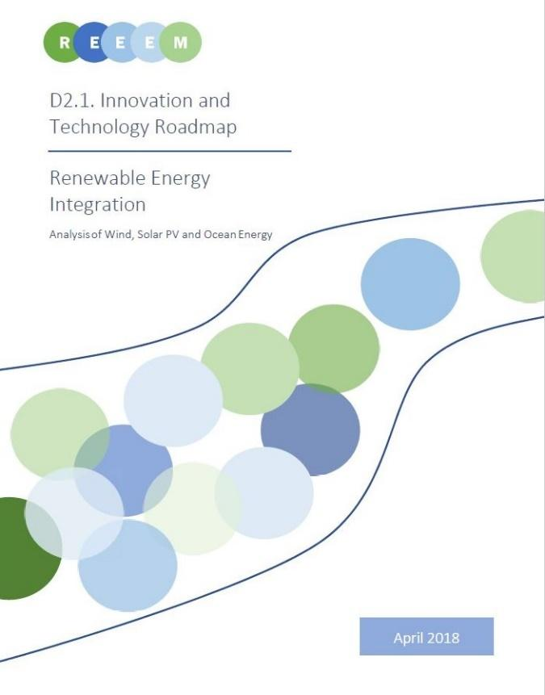

On the 17th April 2018, the REEEM project has hosted its second**REEEM Technology and Innovation Roadmap Workshop on Renewable Energy Integration**, in Brussels.

Renewable energy has the potential to play a big role in the transition pathways toward a European low carbon society. In accordance, ambitious targets have been set for development and deployment of renewable energies in the last decades. To achieve this ambition, there is a need for** technological innovation and sustained market supports**for the development of the renewable energies, as well as for finding approaches to **fully integrate renewable energies into the energy system efficiently and effectively**. Our roadmap will address these issues by thorough analysis of three groups of renewable energies, namely wind, solar and ocean energies.

During the workshop, the Roadmap’s and its preliminary findings have been presented by **Anna Darmani**, from InnoEnergy and the participants have been invited to contribute to the identified technology innovations and market barriers during roundtable session.

We had the chance to welcome a Senior Advisor Renewables and Environment & Public Affairs Coordinator of _EURELECTRIC_, **Hélène LAVRAY**; Associate Professional Renewable Costs and Performance at _IRENA_, **Pablo Ralon**; Renewable Energy Technology Officer at _InnoEnergy_, **Emilien Simonot**, and finally three start-ups dealing with renewable energy, **Principle Power, Solar Worx, Minesto**. All presentations are available below.

Presentations:

[Hélène LAVRAY](https://www.reeem.org/wp-content/uploads/2018/04/Helene-Lavray-Eurelectric.pdf)

[Pablo Ralon](https://www.reeem.org/wp-content/uploads/2018/04/Pablo-Ralon-IRENA.pdf)

[Emilien Simonot](https://www.reeem.org/wp-content/uploads/2018/04/Emilien-Simonot-InnoEnergy.pdf)

[Principle Power](https://www.reeem.org/wp-content/uploads/2018/04/Guillaume-Ardoise-PPI.pdf)

[Solar Worx](https://www.reeem.org/wp-content/uploads/2018/04/SolarWorx-REEEM_Workshop.pdf)

[Minesto](https://www.reeem.org/wp-content/uploads/2018/04/Minesto-REEEM_Workshop.pdf)
