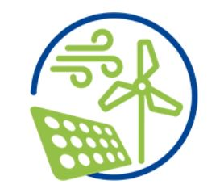

Renewable energy has the potential to play a big role in the transition pathways towards a low carbon society in Europe. The benefits of renewable energy are numerous and recognised, they diversify the European energy supply sources, reduce dependency on fossil fuels (e.g., oil, gas), delimit environmental impact of conventional energy sources and improve the European energy system security against fuel price volatility. Accordingly, the European Union has aimed to increase the share of renewable energy in the electricity industry to about 50% by 2030 and even higher by 2050.

This roadmap studies the development and deployment of several renewable energy technologies and explores technological innovation and market solutions that allow the development of the renewable energy and finding approaches to fully integrate renewable energy into the energy system efficiently and effectively. The roadmap explores onshore and offshore wind power, PV solar power and, tidal and wave power. The roadmap results shed light on a set of technological innovation and also market solutions (in terms of innovative regulations, business models, integration methods, customers & society requirements and value chain settings) that enable shifting the market gaps to opportunities and barriers to effective actions. The roadmap makes several recommendations for policymakers and technology developers on how to improve the position and share of renewable technologies in the European electricity market.

The roadmap results are complemented with the assessment of Innovation Readiness Level (IRL) of the studied renewable energy technologies. The IRL assessment studies innovation readiness of a technology along 5 dimensions of technology readiness level, Intellectual property (IP) readiness level, market readiness level, consumer readiness level and society readiness level.

The findings of the IRL assessments shed light on factors and processes that are prerequisites for a successful technology development and access to the EU electricity market. The reports highlight points in the innovation processes of the studied technologies that can effectively improve their competitiveness in accessing the European electricity market. The results, therefore, provide suggestions for policymakers, investors and industries about the strengths and drawbacks of the innovation processes of the studied renewable technologies.

After the acceptance of the reports, the full versions can be found [here](https://www.reeem.org/index.php/deliverables/).
