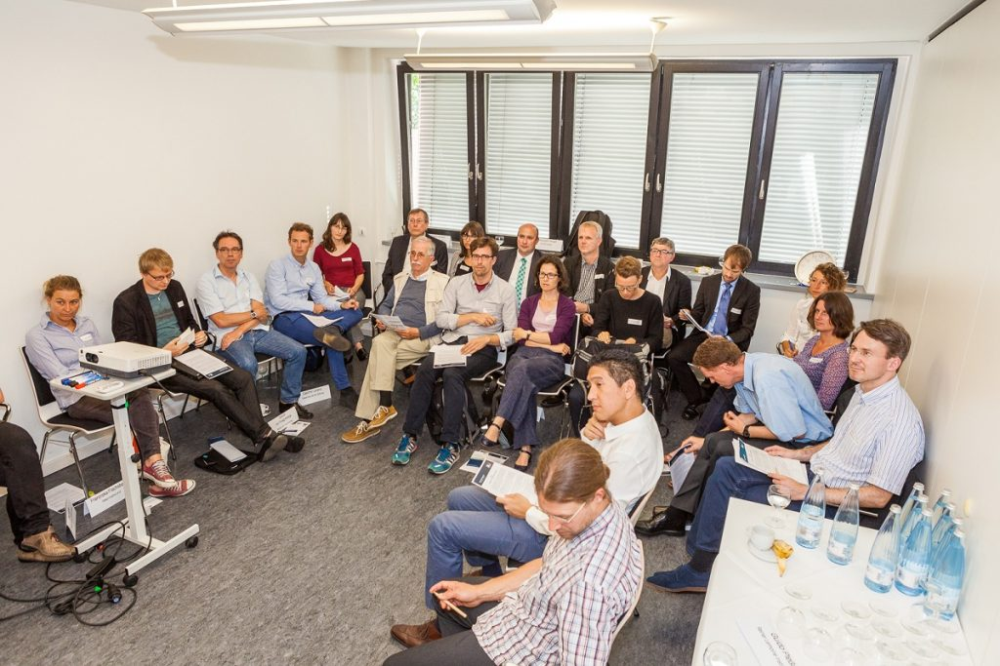

Some basic questions of REEEM were tackled in a Stakeholder Workshop in Berlin on 6th September which was one of three WS at the RLI Energy-Dialogue 2016.

As WS-opener it was discussed if energy system simulations are one of the principal methods in the political discourse of the energy system transformation. The main discussion point was the question if the use of more complex models have more impact on “real energy systems” than simple models (which was neglected and the different use cases of different models as well as their interfaces have been elucidated). The last point was to exchange about methods that can help to improve the transdisciplinary dialogue about the energy system transformation. The event was hosted in German. The results will be summarized and translated to enrich the further stakeholder dialogue of REEEM.

