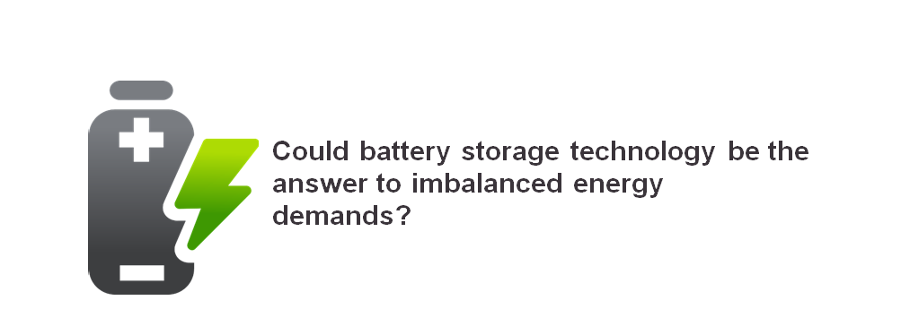

Based on the results of the first [REEEM roadmap on battery storage application (see deliverable D2.1a](https://www.reeem.org/wp-content/uploads/2018/09/D2.1a.pdf)), an online course has been designed and produced by [InnoEnergy](http://www.innoenergy.com/) in order to answer the question: **Could battery storage technology be the answer to imbalanced energy demands?**

This course primarily is based on the analyses and findings of the REEEM roadmap and will cover:

- The need for flexibility demand in the EU electricity industry and the role of battery storage.
- Battery storage technologies: characteristics, potentials and limitations
- Grid-scale application of battery storage
- Behind-the-meter application of battery storage
- Off-grid application of battery storage
- Battery storage application in mobility

Attendance in this course is free and participants need to spend three hours a week over a period of three weeks to finish this course.

You can access this course via [this link. ](https://www.futurelearn.com/courses/battery-storage-applications?utm_campaign=innoenergy_battery_storage_applications_february_2019&utm_medium=organic_blog&utm_source=blog)
