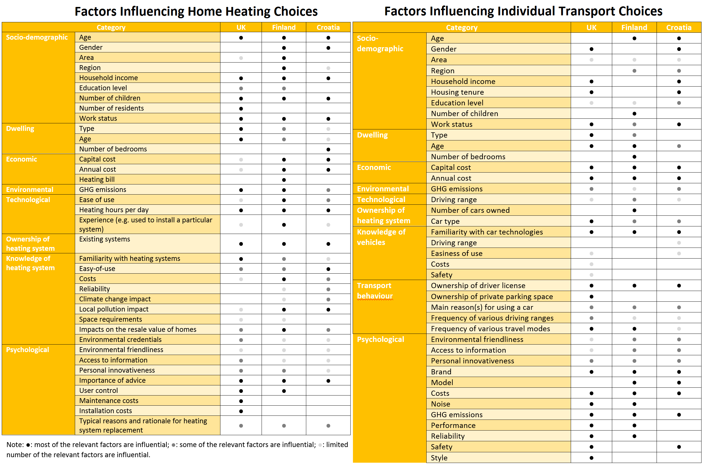

The REEEM project funded a series of detailed empirical studies into individual preferences for low carbon technologies, looking in particular at the factors influencing technology adoption and exploring the differences between several EU member countries. Detailed surveys were carried out on 3000 European households in Finland, Croatia, and the UK. The responses were then used to build databases of individual attitudes and preferences with respect to decisions around home heating and transport. The work is described in a detailed report as well as a policy brief:

- The Focus Report is the longest of the two documents, and sets out the research framing and relationship of the study to the existing literature, details the methodological approach taken, and presents an extensive visualisation and discussion of the results.
- The [Policy Brief](../uploads/2019/05/REEEM-D4.3.pdf) is a much more concise document, and summarises the key implications of the study as they relate to EU climate policy in general and also the use of quantitative system models to support policymaking activity.

A number of key messages emerged from this work. First, we conclude that while consumers’ choices for energy technologies are affected by costs, costs are not the only, or even always the main driver of decisions. The survey and the statistical analysis that followed showed that a range of different factors seem to affect the stated technology choice of individuals (see the tables in the figure above). In some cases, costs were not found to be significant drivers of decisions at all. This demonstrates that policies that only provide economic incentives for new technology adoption might miss the point entirely. It also further underlines the dangers inherent in always representing end users as economically optimising agents in models describing future energy system transitions.

Second, our work shows that consumers can have a strong preference for the technologies they are already familiar with. The ownership of a specific technology appears to be a strong driving factor in whether or not an individual will choose this technology again when the time comes to replace an existing heating system or vehicle. This was often found to be a more important factor than the costs involved in choosing between different alternative technologies. This suggests that there is a significant level of inertia and “stickiness” in individual preferences, which may make it even more difficult for policy makers to influence technology choices, especially with economic incentives.

Third, while it appears that individuals in different European countries can often be influenced by similar factors, a number of differences also emerge. For example, our work found that decisions are less often based strongly on costs in the UK than in the other two countries, while Finnish respondents were less concerned about local control of their heating systems. In general, it appears risky to make broad generalisations about decision drivers like age, gender, income etc. across countries when it comes to designing policies for low carbon technology uptake. A more prudent approach appears to be considering the design of local policies for local circumstances and priorities: When the determinants of decisions are very different, the required incentives to influence decisions are also likely to vary considerably.

Finally, our surveys focused on assessing stated preferences for both home heating technologies and personal transport choices (including automobile purchases). We found that some factors affecting decisions were sector specific (e.g. driving trip frequency), but many were socio-demographic in nature. These however did not have consistent effects across sectors (i.e. when applied to both heating and transport). For example, gender was found to be influential in the case of choices around heating systems in Finland, but apparently of no significance in the case of making choices about cars. The age of respondents seemed to influence heating technology choices in all countries, but in the case of the UK there was no discernible influence of age as a driver affecting car choices. This final finding further emphasises the previous point about the importance of tailored, rather than blanket policies when it comes to the design of policy incentives in the European context.
