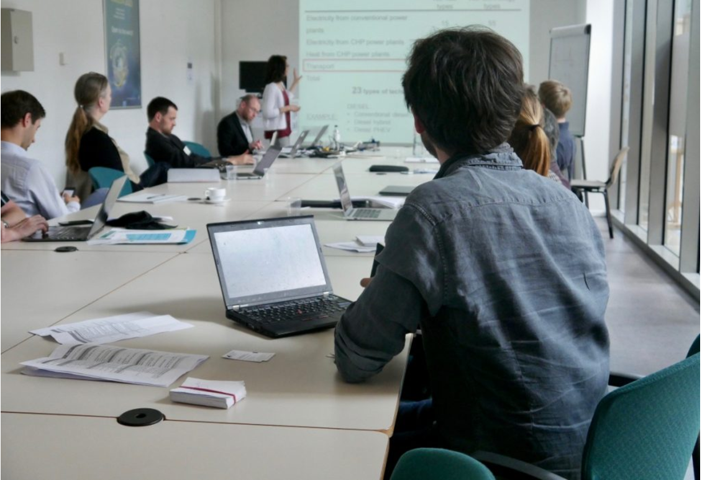

On May 15th and 16th, the third General Assembly of REEEM took place in Brussels. The event took place during an intensive phase of the work in REEEM, where a large and complex modelling framework is being developed.

During the first day and part of the second day, plenary presentations and work sessions were held, on the insights from the pilot experiment run in the previous months, the framework for the formulation of energy transition pathways, the feedback loops between the (more than) 15 models, the importance of LCA considerations and the new-concept REEEM open source pathway database.

During the second day, another plenary session took place, where the Consortium tested successfully, divided in teams, the REEEMGame. This is a web-based dynamic game of the impacts of decisions by competing players on the development of the energy system. Finally, parallel working sessions on more specific themes took place, to pave the way for the next steps in the project.

