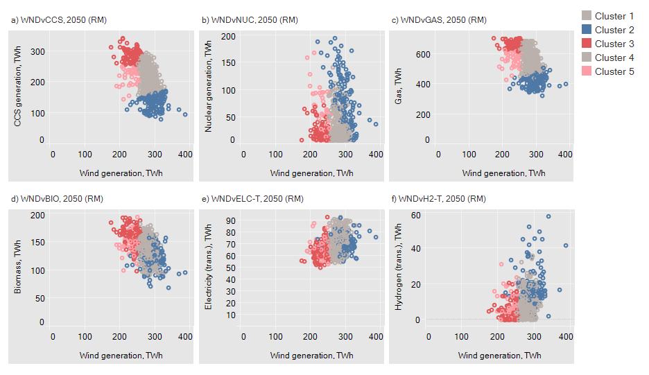

 Clustering example of the relationship between wind generation and other technologies & resources

To meet the stated ambition in the Paris Agreement, Europe’s energy transition needs to be one that effects large-scale emission reductions at an unprecedented rate, with a system that has to be net-zero CO2 emissions by or soon after 2050. Critical to this transition will be the large-scale deployment of existing and new technologies. However, many uncertainties abound concerning future technology cost, performance, deployment, and socio-political feasibility, making planning for this transition challenging.

**A REEEM case study** by [University College London (UCL)](https://www.ucl.ac.uk/), focussing on the UK system, uses energy systems modelling to better understand how different technologies play out together in a future system. Using a probabilistic simulation and clustering approach, the results identify technologies that always deploy at scale (offshore wind, passenger vehicle electrification), or are co-dependent on other technologies (building electrification, alongside retrofit and building level storage), or in competition (biofuels versus hydrogen in the transport sector). Understanding the relationships between technologies is important to better determine the role of technologies energy options under different pathways. It can also help planning what technologies may be needed (or not) alongside others, or prior to deployment of others.

Crucially, the analysis shows that these relationships vary depending on wider system factors, notably climate ambition and the availability of CCS. This is particularly important with CCS, a technology that in many models provides a cost-effective pathway but is at risk of not being scaled at the levels proposed (due to technical, economic and political uncertainties). Understanding the system wide influences of keystone technologies such as CCS on the deployment of others is crucial, to weigh the relative risks of technology failure and the robustness of any future strategy.

The full report **_Coevolution and competition of technologies in a low carbon system_** can be found [here](../uploads/2018/07/REEEM-D2.4-Technologies-in-Low-Carbon-System.pdf).
